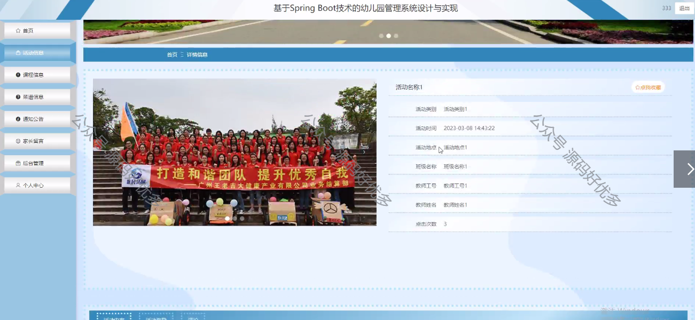

 
## 查看主页获取源码

> **作者介绍**： **✌**全网粉丝10W+本平台特邀作者、博客专家、CSDN新星计划导师、java领域优质创作者,博客之星、掘金/华为云/阿里云/InfoQ等平台优质作者、专注于项目实战 **✌**

  

### 一、作品包含

源码+数据库+设计文档万字+PPT+全套环境和工具资源+部署教程

### 二、项目技术

前端技术：Html、Css、Js、Vue、Element-ui

数据库：MySQL

后端技术：Java、Spring Boot、MyBatis

  

### 三、运行环境

开发工具：IDEA/eclipse

数据库：MySQL5.7

数据库管理工具：Navicat10以上版本

环境配置软件： JDK1.8+Maven3.6.3

前端Nodejs：14

### 四、项目介绍
项目编号：springbootA099

幼儿园管理系统是一款针对学前教育机构设计的智能化管理软件，旨在提高幼儿园的管理效率、优化教育教学质量以及加强家园互动。在当前社会，随着家长对幼儿教育的重视程度不断提升，幼儿园对科学化、规范化管理的需求日益增长，幼儿园管理系统的出现正是为了满足这一需求，通过信息化手段对幼儿园的日常运营从而促进幼儿园的持续发展。

前台功能浏览首页、活动信息、课程信息、菜谱信息、通知公告、家长留言、后台管理、个人中心

后台分为教师、家长、管理员
教师：系统首页、个人中心、家长管理、班级信息管理、活动信息管理、活动名次管理、课程信息管理、教师考勤管理、学生考勤管理、成长记录管理、系统管理
家长：系统首页、个人中心、活动名次管理、学生考勤管理、成长记录管理
管理员：系统首页、个人中心、家长管理、教师管理、班级信息管理、活动类型管理、活动信息管理、活动名次管理、课程信息管理、教师考勤管理、学生考勤管理、菜谱信息管理、成长记录管理、物资信息管理、家长留言、系统管理

### 五、运行截图

  
